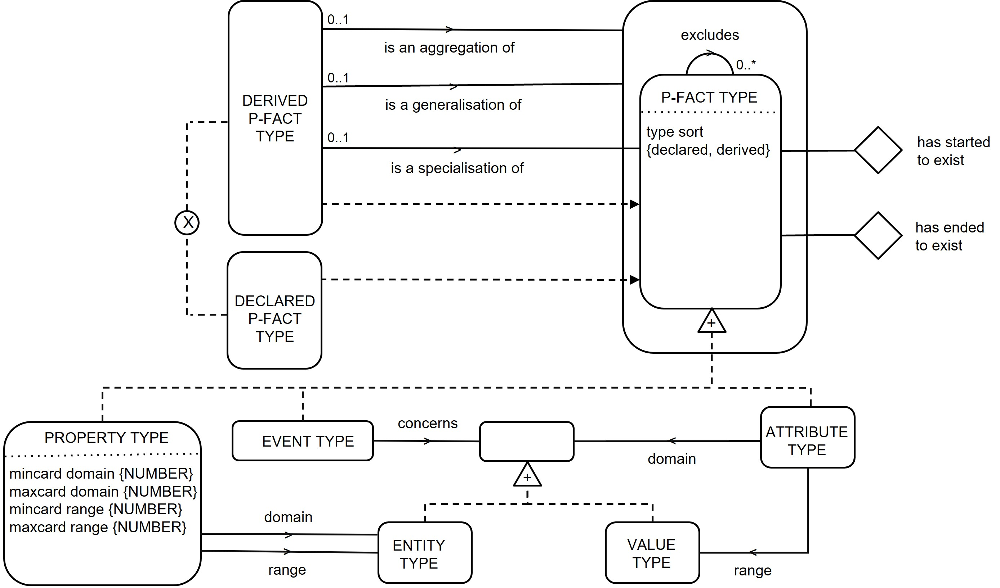
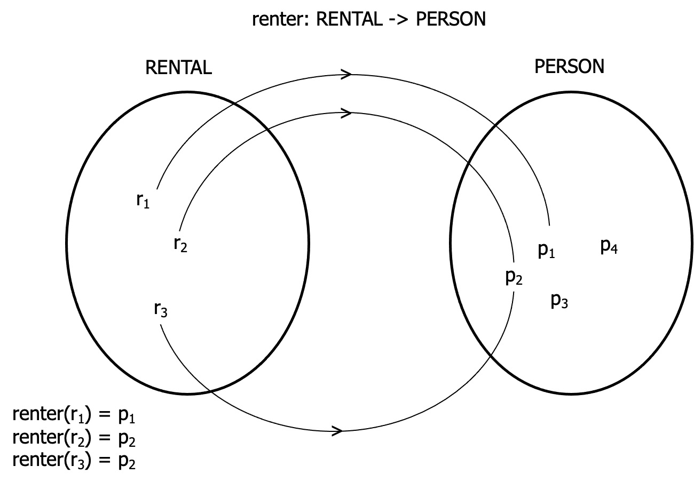
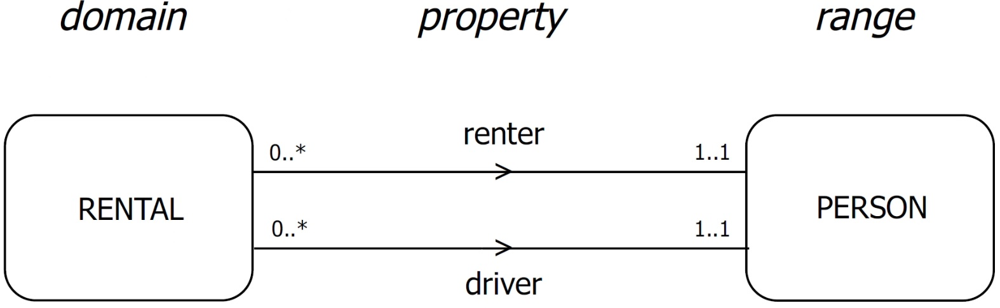
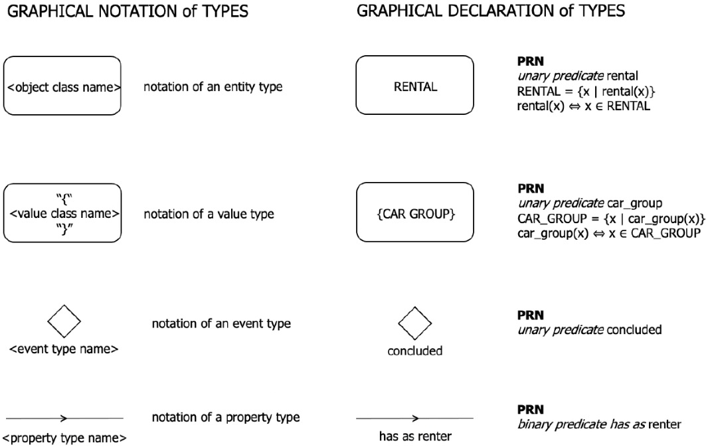
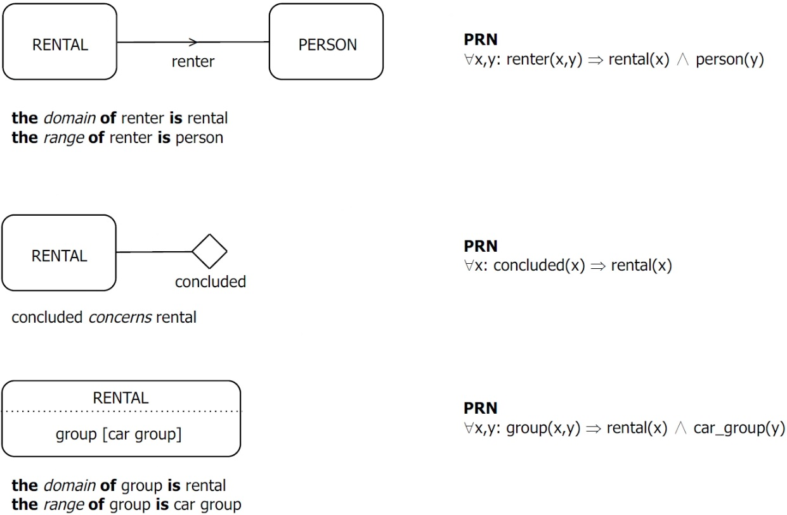
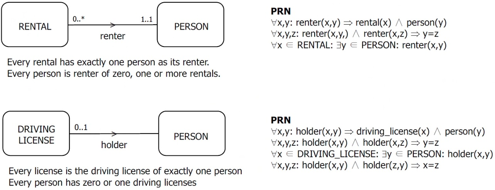
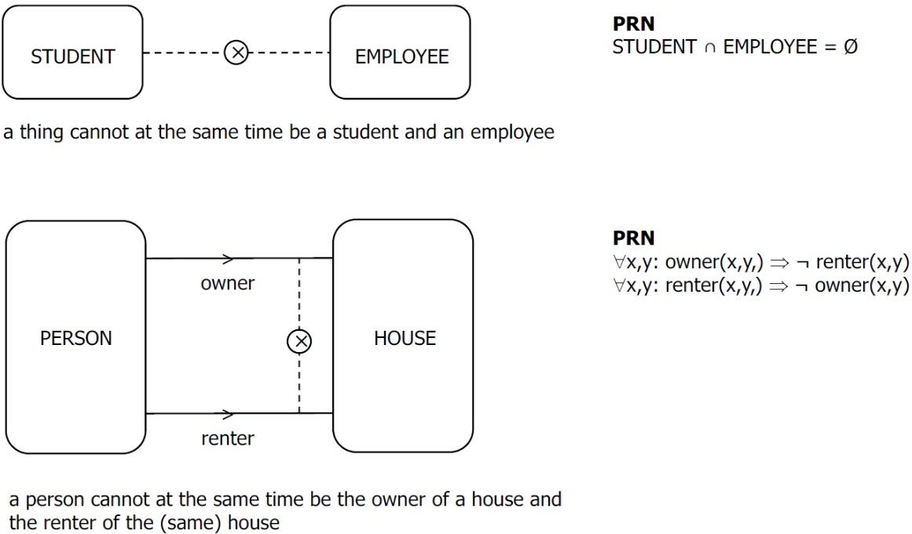
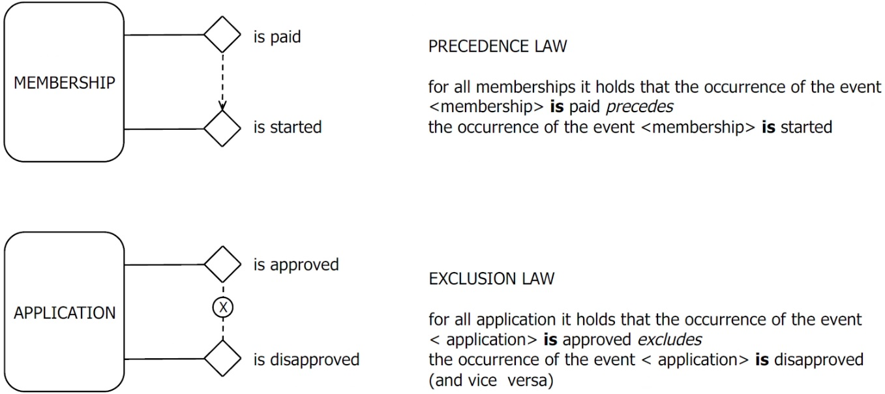
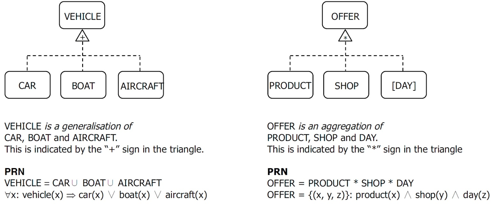
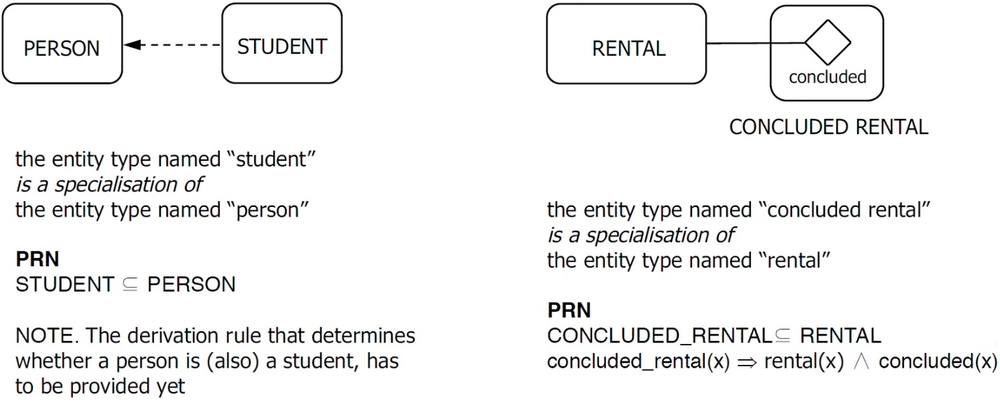

# The graphical formalism of GOSL
The General Ontology Specification Language (GOSL) is a general language, expressed in first-order logic, to define domain specific modeling languages.

## TODO
- [ ] decide on structure and form
- [ ] is GOSL for specifying state and transition space, or to specify languages to specify ...
- [ ] textual formalism = abstract or concrete syntax?
- [ ] should we discern abstract from concrete syntax?
- [ ] schemas are called ontological as names and other lexical attributes are left out. GOSL meta schema does not contains names, but textual formalism of GOSL does (...)

## Purpose of this document/language

## Summary of relevant theories

### FI
- Fact, information, thing, object, type, class
- Creation of types: declaration and derivation

### MU (needed?)
- Model is a role notion: any subject using a complex A that is neither directly nor indirectly interacting with complex B, to obtain information about complex B, is using A as a model of B. After Apostel, where complex refers to either a system or an aggregate (of systems (?))
- A (conceptual) complex (model) is an instantiation of a conceptual schema (meta model)
- A conceptual schema of a world is a specification of its state space and its transition space.
- A domain specific (conceptual) modeling language is the combination of a conceptual schema (semantics) and a corresponding symbolic formalism (syntax)
- A conceptual schema is an instantiation (expression) of a meta schema (meta meta model)
- A general modeling language (not domain specific) (conceptual) modeling language is the combination of a meta schema and a corresponding symbolic formalism
- A meta schema is an instantiation of itself

## Core concepts/abstract syntax
- entity type
- property type
- attribute type
- value type
- event type?

<a name="goslschema">

[//]: <> (Appendix A assumes that the reader knows the graphical formalism of GOSL. This need not be)
[//]: <> (the case for everyone. Therefore, we copy the relevant part of [1] Chap. 6 below. The textual)
[//]: <> (formalism of GOSL is included already in Chap. 2, The basics of DEMO-SL)

## Optional: rules

## Concrete syntax/visualization

## Optional: tool support

The graphical formalism of GOSL is based on the Venn diagram, as illustrated by Fig. 1.
There are two sets: RENTAL (with example elements r1, r2 and r3) and PERSON (with example elements p1, p2, p3 and p4).
The function renter is shown as a mapping from RENTAL to PERSON, which are respectively the domain and the range of renter.
The expression renter(ri) = pj means that person pj is the renter of rental ri.

<a name="mathfuncmapping">

<a name="propmapping">

Fig. 2 exhibits the more stylised way in which functional mappings are represented in GOSL.
The roundangles represent entity classes, thus the extensions of entity types (cf. [1] Chap. 5).
The functions are now called properties.
One best considers the lines with an arrow in the middle as the bundles of separate mappings from elements in RENTAL to elements in PERSON ([cf. Fig. 1](#mathfuncmapping)).

**Cardinality ranges are denoted as:**
- `<min>..<max>` 
- Examples: `0..1`, `1..1`, `0..*`, `1..*` ("*" means undetermined)

**The default ranges are:**
- `1..1` at the side of the range, meaning that every element in the domain is connected to exactly one element in the range
- `0..*` at the side of the domain, meaning that an element in the range need not be connected to an element in the domain, and if it does, it may be connected to many elements

Default cardinality ranges need not be indicated (they may be omitted).

The strings “0..*” and “1..1” denote the cardinality ranges that apply.
The first number is de minimum cardinality and the second one the maximum cardinality.
The symbol “*” (which can only occur as the maximum cardinality) means that the number is undetermined, i.e. any number larger than or equal to the minimum cardinality is allowed.
The cardinality ranges in Fig. 2 state that every rental has exactly one person as its renter (minimum 1 and maximum 1), and that
every person is the renter of an arbitrary number of rentals (minimum 0 and maximum *).
The ranges shown in Fig. 2 are the default ones.
They may be omitted, as is done e.g. in Fig. 4.

<a name="mathfuncmapping">

Hereafter, the remainder of the graphical formalism of GOSL is presented in a number of figures.
Fig. 3 shows the graphical notation of the distinct types (entity, event, value, property and attribute) as well as the way in which they are entered into a conceptual schema, either by declaration or by derivation.

In terms of logic, entity types and event types are unary predicates, whereas property types and attribute types are binary predicates.
To emphasise that a roundangle denotes a class, the class name is written in capitals.
Next to every figure, the logical formulation is shown, in the well-known Peano-Russell Notation (PRN).

As mentioned in [1] Sect. 6.2.3, a conceptual schema of a world is a specification of its state space and its transition space.
The state space of a world is determined first of all by the distinct sorts of facts (entities, events, properties and attributes) that may exist in a state of the world.
In addition, it is determined by the applicable existence laws. 
Existence laws regulate the co-existence of facts.
We distinguish three kinds of existence laws: reference laws, cardinality laws and exclusion laws.

Reference laws state which facts must exist together.
They are shown in Fig. 4.
As an example, if the property type ‘renter’ exists, then its domain and its range must also exist.
This is expressed in the figure by connecting the representation of the property renter with the representations of the classes RENTAL and PERSON.
Like roundangles represent classes of entities (of a specific type), diamonds represent classes of events (of a specific type).
An event is a unary predicate
concerning an entity.
As exemplified in Fig. 4, the unary predicate ‘concluded’ holds for
elements of the class RENTAL.
If GOSL is used to model the production world of an organisation (cf. [1] Chap. 8), an event is the becoming existent of the independent fact of a product, as the result of a transaction.
Events are thus elementary state changes (cf. [1] Chap. 9).
As extensively discussed in [1] Chap. 8, a number of so-called dependent facts may start to exist together with an independent fact.

<a name="referencelaw">

Attributes are a special kind of properties.
The distinction is first, that the range of an attribute type is a value class, whereas the range of a (normal) property type is an entity class, and second, that both cardinality ranges are the default ones (cf. Fig. 2).
This allows for a more compact notation of attribute types, as shown in Fig. 4 (bottom).
The domain of the attribute group is the class RENTAL and the range is the extension of the value type car group.

**GRAPHICAL SPECIFICATION of REFERENCE LAWS**

| Element | PRN Notation |
|---------|--------------|
| concluded concerns rental | ∀x: concluded(x) ⇒ rental(x) |
| the domain of renter is rental | ∀x,y: renter(x,y) ⇒ rental(x) ∧ person(y) |
| the range of renter is person | |
| the domain of group is rental | ∀x,y: group(x,y) ⇒ rental(x) ∧ car_group(y) |
| the range of group is car group | |

<a name="cardinalitylaw">

Cardinality laws provide a further specification of reference laws, by stating what their cardinality ranges are, as shown in Fig. 5.
As said, the default values (so “0..*” on the side of the domain and “1..1” on the side of the range) may be omitted, and therefore usually are omitted.

**GRAPHICAL SPECIFICATION of CARDINALITY LAWS**

| Relationship | Description | PRN Notation |
|-------------|-------------|--------------|
| renter (RENTAL to PERSON) | Every rental has exactly one person as its renter. Every person is renter of zero, one or more rentals. | ∀x,y: renter(x,y) ⇒ rental(x) ∧ person(y) ∀x,y,z: renter(x,y,) ∧ renter(x,z) ⇒ y=z ∀x ∈ RENTAL: ∃y ∈ PERSON: renter(x,y) |
| holder (DRIVING LICENSE to PERSON) | Every license is the driving license of exactly one person. Every person has zero or one driving licenses | ∀x,y: holder(x,y) ⇒ driving_license(x) ∧ person(y) ∀x,y,z: holder(x,y) ∧ holder(x,z) ⇒ y=z ∀x ∈ DRIVING_LICENSE: ∃y ∈ PERSON: holder(x,y) ∀x,y,z: holder(x,y) ∧ holder(z,y) ⇒ x=z |

<a name="exclusionlaw">

Exclusion laws serve to specify which facts cannot exist together, in addition to the restrictions that are already expressed in reference laws and cardinality laws.
In other words, they state that the existence of a fact excludes the existence of one or more other facts.
Fig. 6 exhibits their graphical notation.
We assume that the figure is self-explaining.
Like existence laws determine the set of lawful states of a world, occurrence laws determine which state transitions are lawful.
Two kinds of occurrence laws are distinguished: precedence
laws and preclusion laws.
They are presented in Fig. 7, which we assume is self-explaining.
A precedence law states that an event of some type, concerning a particular entity, must always precede an event of some other type, concerning the same entity.
A preclusion law states that an event of some type, concerning a particular entity, forbids the (future) occurrence of an event of some other type, concerning the same entity.

<a name="occurencelaw">

**GRAPHICAL SPECIFICATION of OCCURRENCE LAWS**

| Law Type | Description |
|----------|-------------|
| PRECEDENCE LAW | for all memberships it holds that the occurrence of the event `<membership> is paid` precedes the occurrence of the event `<membership> is started` |
| EXCLUSION LAW | for all application it holds that the occurrence of the event `< application> is approved` excludes the occurrence of the event `< application> is disapproved` (and vice versa) |

Existence laws that cannot or not easily be specified graphically, must be specified textually in GOSL.
Here are some, presumably self-explaining, examples of textual specifications (words between the brackets "[" and "]" denote variables):

- `[membership] is started on [day] implies that [day] is the first day of some [month] and that [month] is equal to or greater than the Current Month;`
- `[membership] is started on [day] implies that the age of the member of [membership] on [day] is equal to or greater than the minimum age in the year of [day];`

Next to introducing concept types in a conceptual schema by declaration, as explained above, one can introduce types by derivation, meaning that one defines a new type on the basis of existing types.
In Fig. 8 and Fig. 9, the graphical specification of three kinds of derived types are shown: specialisation, generalisation and aggregation, in accordance with their definitions in the FI theory (cf. [1] Chap. 5).

<a name="derivedtypes">

Fig. 8 (left side) exhibits an example of generalisation.
It defines in a precise and complete way the derived type vehicle: a vehicle is either a car or a boat or an aircraft.
As discussed in [1] Chap. 5, specialisation and generalisation are not each other’s inverses.
They are fundamentally different ways of constructing a type on the basis of one or more other types.
The only invertible relationships between types is the subtype-supertype relationship.
For example, student is a subtype of person, and thus is person = a supertype of student (cf. Fig. 9).
Likewise, boat is a subtype of vehicle and thus vehicle is a supertype of boat, etc.

On the right side of Fig. 8, the notion of aggregation is explained. 
The derived concept offer could be useful for comparing the prices of a product (on a day) in different shops.
The price would then be an attribute type of the entity type offer.

**GRAPHICAL SPECIFICATION of GENERALISATION and AGGREGATION**

| Type | Description | PRN Notation |
|------|-------------|--------------|
| VEHICLE (generalisation) | VEHICLE is a generalisation of CAR, BOAT and AIRCRAFT. This is indicated by the "+" sign in the triangle. | VEHICLE = CAR ∪ BOAT ∪ AIRCRAFT ∀x: vehicle(x) ⇒ car(x) ∨ boat(x) ∨ aircraft(x) |
| OFFER (aggregation) | OFFER is an aggregation of PRODUCT, SHOP and DAY. This is indicated by the "*" sign in the triangle | OFFER = PRODUCT * SHOP * DAY OFFER = {(x, y, z)}: product(x) ∧ shop(y) ∧ day(z) |

<a name="derivedtypes2">

The definition of the specialisation completed_rental in Fig. 9 (right side) is comprehensive.
The definition of the specialisation student (left side), however, needs to be complemented by a precise rule, e.g. that a student is a person for whom there is an admission in which this person is the applicant.

**GRAPHICAL SPECIFICATION of SPECIALISATION**

| Type | Description | PRN Notation |
|------|-------------|--------------|
| STUDENT | the entity type named "student" is a specialisation of the entity type named "person" | STUDENT ⊆ PERSON NOTE. The derivation rule that determines whether a person is (also) a student, has to be provided yet |
| CONCLUDED RENTAL | the entity type named "concluded rental" is a specialisation of the entity type named "rental" | CONCLUDED_RENTAL ⊆ RENTAL concluded_rental(x) ⇒ rental(x) ∧ concluded(x) |

Derived types which are not, or not completely, specified graphically, must be specified textually in GOSL.
Here are some, presumably self-explaining, examples of textual specifications of derived types:
- `the age of [person] on Day = Day minus the day of birth of [person]`
 - *% Note that the age is expressed in Julian %*
- `the first fee of [membership] = (((12 minus the month of the starting day of [membership]) plus 1) divided by 12) times the annual fee in the year of the starting day of [membership]`

